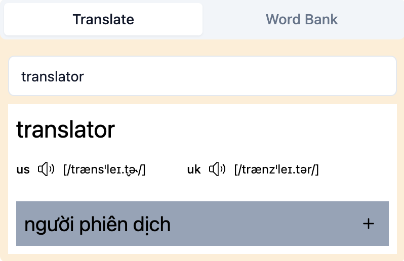
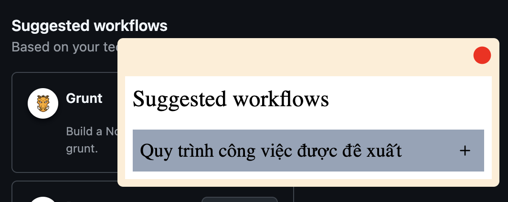
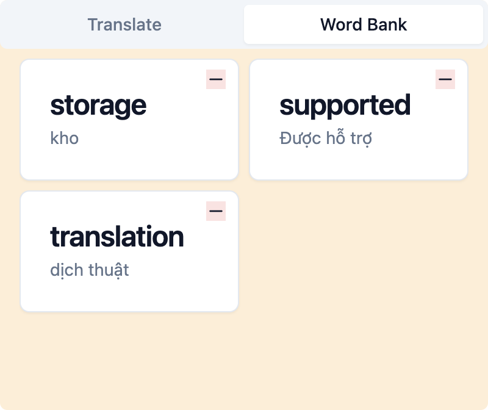

# My Translator Chrome Extension

- Frustrated by the limitations of existing translator extensions, especially when it came to learning new vocabulary, I created this app to address those shortcomings. This app empowers you to:

* Translate words effortlessly
* Save words for future review and learning
* Enjoy a user-friendly, draggable interface for seamless integration into your browsing experience

## Preview





## React 18 and TailwindCSS Supported

- [x] Webpack Compatible
- [x] TailwindCSS 3.0 Compatible

## TODO

- [x] Implement translation feature
- [x] Implement "save vocabulary" feature
- [x] Implement "translate selection text" feature
- [x] Implement "draggable translation panel" feature
- [ ] Enhance popup with more information

## Dev tools

- Help checking storage: https://chromewebstore.google.com/detail/storage-area-explorer/ocfjjjjhkpapocigimmppepjgfdecjkb

## My Notes

```
- Access this for popup development, please change the id with your extension id!

chrome-extension://abdkegfbdliahgcdgfgfaedmoghihheb/popup.html
```
